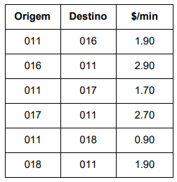
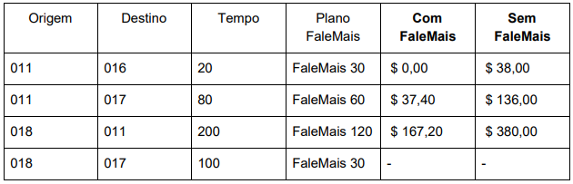

<!-- Logo Section -->
<p align="center">
   <a href="https://github.com/kyotodevindie">
      
   </a>
</p>


<!-- Challenge Section -->
### Challenge
<br>
  <p>
    The telephone company Telzir, specialized in national long distance calls, will place
a new product on the market called FaleMais. 
  <br><br>
    Normally a Telzir customer can make a call from one city to another by paying a
fixed rate per minute, with the price being pre-defined in a list with the DDD codes of
Origin and destiny:
  <br><br>  
  
  <br><br>
 With Telzir's new FaleMais product, the customer purchases a plan and can talk for free up to
a certain amount of time (in minutes) and you only pay for the excess minutes. the extra minutes
has a 10% surcharge on the normal minute rate. Plans are FaleMais 30 (30
minutes), FaleMais 60 (60 minutes) and FaleMais 120 (120 minutes).
  <br><br>
Telzir, concerned with transparency with its customers, wants to provide a
web page where the customer can calculate the call value. There, the customer can choose the
origin and destination city codes, the connection time in minutes and choose which
SpeakMore plan. The system should show two values: (1) the value of the connection with the plan and (2)
without the plan. The initial cost of acquiring the plan should be disregarded for this problem.
  <br><br>
  Example
    <br><br>  
  
  <br><br>
  
  <!-- Demo Section -->
### Demo
  <a href="https://vialaser-challenge.vercel.app/"></a>
</p>


<!-- Build With Section -->
### Built With

- [React](https://pt-br.reactjs.org/)
- [Chakra-Ui](https://chakra-ui.com/)
- [StoryBook](https://storybook.js.org/)
- [PropTypes](https://www.npmjs.com/package/prop-types)
- [React-Testing-Library](https://testing-library.com/docs/react-testing-library/intro/)
- [Eslint](https://eslint.org/)
- [Prettier](https://prettier.io/)


<!-- Installation Section -->
### Installation

1. Clone the repo

```sh
git clone https://github.com/kyotodevIndie/tasks..git
```

3. Install the packages using NPM or Yarn

```sh
yarn
```
4. run the project

```sh
yarn start
```

5. Open [http://localhost:3000](http://localhost:3000) with your browser to see the result.

6. Happy coding!


<!-- Utils Section -->
### Utils

1. To run the project
```sh
yarn start
```
2. To run the storybook
```sh
yarn run storybook
```
3. To run the build
```sh
yarn build
```
4. To run the tests
```sh
yarn test
```
5. To run the EsLint 
```sh
yarn lint
```


<!-- Contributing Section -->
## Contributing

Contributions are what make the open source community such an amazing place to be learn, inspire, and create. Any contributions you make are **greatly appreciated**.

1. Fork the Project
2. Create your Feature Branch (`git checkout -b feature/AmazingFeature`)
3. Commit your Changes (`git commit -m 'Add some AmazingFeature'`)
4. Push to the Branch (`git push origin feature/AmazingFeature`)
5. Open a Pull Request


<!-- License Section -->
## License

Distributed under the MIT License. See `LICENSE` for more information.


<!-- Thank you Section -->
## Thank you!

   <p> 
    thank you for your patience to read this far! if possible, give a star!
   </p> 
   
